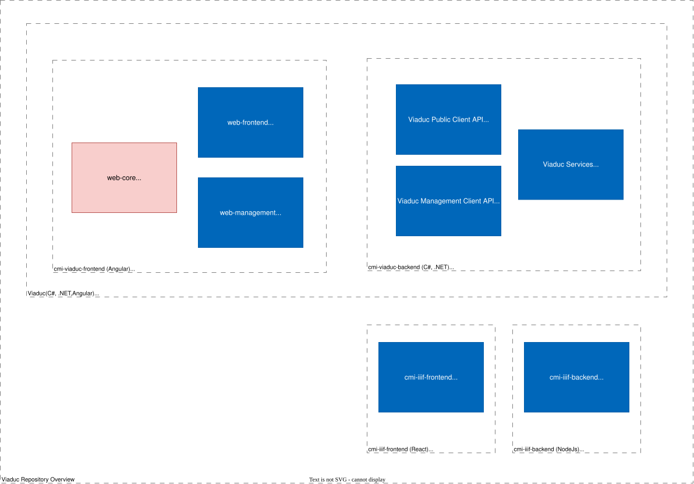

# cmi-viaduc-web-core
- [cmi-viaduc](https://github.com/SwissFederalArchives/cmi-viaduc)
   - [cmi-viaduc-backend](https://github.com/SwissFederalArchives/cmi-viaduc-backend)   
	   - **[cmi-viaduc-web-core](https://github.com/SwissFederalArchives/cmi-viaduc-backend/tree/master/CMI/Web.Clients/web-core)** :triangular_flag_on_post:
	   - [cmi-viaduc-web-frontend](https://github.com/SwissFederalArchives/cmi-viaduc-backend/tree/master/CMI/Web.Clients/web-frontend)
	   - [cmi-viaduc-web-management](https://github.com/SwissFederalArchives/cmi-viaduc-backend/tree/master/CMI/Web.Clients/web-management)
   - [cmi-iiif-frontend](https://github.com/SwissFederalArchives/cmi-iiif-frontend)
   - [cmi-iiif-backend](https://github.com/SwissFederalArchives/cmi-iiif-backend)

# Context

The [Viaduc](https://github.com/SwissFederalArchives/cmi-viaduc) project includes 3 code repositories. The present project `cmi-viaduc-web-core` is an Angular library. This library is used in the other two applications _public access_ ([cmi-viaduc-web-frontend](https://github.com/SwissFederalArchives/cmi-viaduc-backend/tree/master/CMI/Web.Clients/web-frontend)) and _internal management_ ([cmi-viaduc-web-management](https://github.com/SwissFederalArchives/cmi-viaduc-backend/tree/master/CMI/Web.Clients/web-management)) as a common code base and component library. The frontend applications are hosted in an `ASP.NET` container (see _backend_ repository [cmi-viaduc-backend](https://github.com/SwissFederalArchives/cmi-viaduc-backend)) and communicate with the system via web API.
With the release 2.0.0.1113, two new repositories were added to provide the system with IIIF viewer capabilities. There is the actual _IIIF-Viewer_ ([cmi-iiif-frontend](https://github.com/SwissFederalArchives/cmi-iiif-frontend)) and the required _backend_ ([cmi-iiif-backend](https://github.com/SwissFederalArchives/cmi-iiif-backend)) that adds the required IIIF services like search.

With the release 2.3.0.1151, the public access application, the internal management application and core application are moved under repository( [cmi-viaduc-backend](https://github.com/SwissFederalArchives/cmi-viaduc-backend/).

> Note: A general description of the repositories can be found in the repository [cmi-viaduc](https://github.com/SwissFederalArchives/cmi-viaduc).

# Architecture and components

This is an Angular CLI library published in an internal package feed and included in the [cmi-viaduc-web-frontend](https://github.com/SwissFederalArchives/cmi-viaduc-backend/tree/master/CMI/Web.Clients/web-frontend) and [cmi-viaduc-web-management](https://github.com/SwissFederalArchives/cmi-viaduc-backend/tree/master/CMI/Web.Clients/web-management) projects.
It contains components, services and model classes that are needed in both projects.

## Modules

- `core`
  - Common components for running the application, e.g. Configs, BreadCrumbs, ErrorHandling, Modals
- `orders`
  - Components for the order management part in the public and management client
- `tooltip`
  - Tooltip component
- `wijmo`
  - Custom implementation of the Wijmo grid with extended functionality (e.g. save sort states, filters, etc.)
  - Note: For productive use of this component a Wijmo license is required. It can be ordered at `https://www.grapecity.com/wijmo/licensing`.

# Installation

## Preparations

- [Node.js download](https://nodejs.org/en/), LTS-version
- Make sure that old angular/cli versions are uninstalled
  - `npm uninstall angular-cli`
  - `npm uninstall @angular/cli`
  - `npm cache clean --force`
- Install Angular CLI
  - `npm install -g @angular/cli`

## Install

- Install packages with `npm i`
- Build library with `npm run build`

# Customization

## General

- Pay attention to TSLint
- Move business logic to services

## Run tests

- Run tests once `ng test --watch=false`
- Run tests as watcher `ng test`

## Embedding the library

- The library `web-core` would be delivered as part of an application.:
  - `web-core`, `-web-management` and `web-frontend` are delivered in the same root in the filesystem (e.g. `C:\Viaduc\CMI\Web.Clients`).
  - Build the library `web-core` with `npm run build`.
  - In the target application (e.g. `web-frontend`, `web-management`) link the library using `npm run link`.

# Authors

- [CM Informatik AG](https://cmiag.ch)
- [Evelix GmbH](https://evelix.ch)
- [Akros AG](https://akros.ch)

# License

GNU Affero General Public License (AGPLv3), see [LICENSE](LICENSE.TXT).

# Contribute

This repository is a copy which is updated regularly - therefore contributions via pull requests are not possible. However, independent copies (forks) are possible under consideration of the AGPLV3 license.

# Contact

- For general questions (and technical support), please contact the Swiss Federal Archives by e-mail at bundesarchiv@bar.admin.ch.
- Technical questions or problems concerning the source code can be posted here on GitHub via the "Issues" interface.
