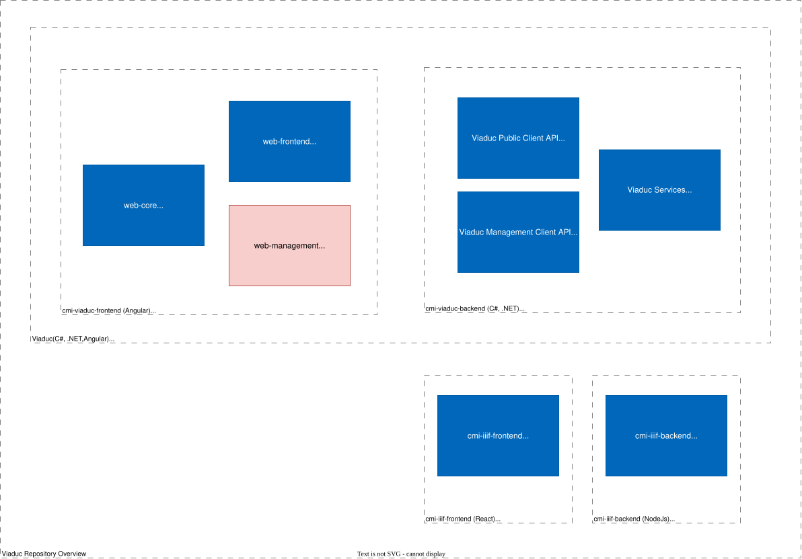

# cmi-viaduc-web-management

- [cmi-viaduc](https://github.com/SwissFederalArchives/cmi-viaduc)
  - [cmi-viaduc-backend](https://github.com/SwissFederalArchives/cmi-viaduc-backend)
    - [cmi-viaduc-web-core](https://github.com/SwissFederalArchives/cmi-viaduc-backend/tree/master/CMI/Web.Clients/web-core)
	- [cmi-viaduc-web-frontend](https://github.com/SwissFederalArchives/cmi-viaduc-backend/tree/master/CMI/Web.Clients/web-frontend)
	- **[cmi-viaduc-web-management](https://github.com/SwissFederalArchives/cmi-viaduc-backend/tree/master/CMI/Web.Clients/web-management)** :triangular_flag_on_post:  
  - [cmi-iiif-frontend](https://github.com/SwissFederalArchives/cmi-iiif-frontend)
  - [cmi-iiif-backend](https://github.com/SwissFederalArchives/cmi-iiif-backend)

# Context

The [Viaduc](https://github.com/SwissFederalArchives/cmi-viaduc) project includes 3 code repositories. The present project `cmi-viaduc-web-management` is an Angular application designed for internal management.
Together with the _public access_ application ([cmi-viaduc-web-frontend](https://github.com/SwissFederalArchives/cmi-viaduc-backend/tree/master/CMI/Web.Clients/web-frontend)) it uses a common code library ([cmi-viaduc-web-core](https://github.com/SwissFederalArchives/cmi-viaduc-backend/tree/master/CMI/Web.Clients/web-core)). The frontend applications are hosted in an `ASP.NET` container (see backend repository [cmi-viaduc-backend](https://github.com/SwissFederalArchives/cmi-viaduc-backend)) and communicate with the system via a web API. With the release 2.0.0.1113, two new repositories were added to provide the system with IIIF viewer capabilities. There is the actual _IIIF-Viewer_ ([cmi-iiif-frontend](https://github.com/SwissFederalArchives/cmi-iiif-frontend)) and the required _backend_ ([cmi-iiif-backend](https://github.com/SwissFederalArchives/cmi-iiif-backend)) that adds the required IIIF services like search.

With the release 2.3.0.1151, the public access application, the internal management application and core application are moved under repository( [cmi-viaduc-backend](https://github.com/SwissFederalArchives/cmi-viaduc-backend/).

> Note: A general description of the repositories can be found in the repository [cmi-viaduc](https://github.com/SwissFederalArchives/cmi-viaduc).

# Architecture and components

This is an Angular CLI application.
The files generated by the build process are stored in the `client` folder within the `CMI.Viaduc.Web.Management` WebAPI project.

The application contains the management GUI for Viaduc.

## Modules

- `app`
  - Components that are directly accessed by routing (1st level route) (`pages`)
- `administration`
  - Components and pages for the administration of the system, e.g. parameter administration, monitoring page, etc.
- `authorizeAccess`
  - components and pages for the administration of delivery offices and tokens
- `ordermanagement`
  - Components and pages for the administration of the order process
- `userAndRoles`
  - Components and pages for managing users and their roles
- `client`
  - Remaining components and services used within the pages, e.g. for search, ordering, navigation, etc.
- `shared`
  - Components used in multiple modules

# Installation

## Preparations

- [Node.js download](https://nodejs.org/en/), LTS version
- Make sure that old angular/cli versions are uninstalled
  - `npm uninstall angular-cli`
  - `npm uninstall @angular/cli`
  - `npm cache clean --force`
- Install Angular CLI
  - `npm install -g @angular/cli`
- Change to the `web-core` directory with a command line
  - Execute: `npm i` to install the dependencies
  - Run: `npm run build` to build the library

## Install

- Change to the directory `web-management` with a command line tool
  - Run: `npm run link` to link `web-core` as component
  - Run: `npm i` to install the dependencies
  - Run: `npm run build` to build the project into the `dist` folder inside `web-management`
  - Run: `npm run build-local` to build the project directly into `..\..\Web\CMI.Web.Management\client`

# Customization

## General

- Pay attention to TSLint
- Move business logic into services

## Run tests

- Run tests once `ng test --watch=false`
- Run tests as watcher `ng test`

## Execute

- Variant a.)
  - Build using `npm run build` and start ASP.NET (`CMI.Viaduc.Web.Management`)
- Variant b.)
  - Start running build (file watch) using `npm run start` and ASP.NET (`CMI.Viaduc.Web.Management`); the watcher writes directly into `..\..\Web\CMI.Web.Management\client`

# Authors

- [CM Informatik AG](https://cmiag.ch)
- [Evelix GmbH](https://evelix.ch)
- [Akros AG](https://akros.ch)

# License

GNU Affero General Public License (AGPLv3), see [LICENSE](LICENSE.TXT)

# Contribute

This repository is a copy which is updated regularly - therefore contributions via pull requests are not possible. However, independent copies (forks) are possible under consideration of the AGPLV3 license.

# Contact

- For general questions (and technical support), please contact the Swiss Federal Archives by e-mail at bundesarchiv@bar.admin.ch.
- Technical questions or problems concerning the source code can be posted here on GitHub via the "Issues" interface.
