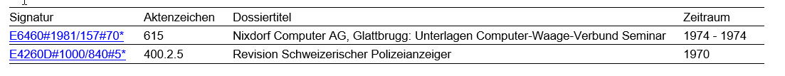

# DataBuilder für Emails

 Mit dem DataBuilder erzeugt man sich ein dynamisches Objekt (Expando), welches für die Generierung von Emails mittels Mustache verwendet wird. Dabei stehlt das Expando die Daten zu Verfügung und die Mustache-Datei bestimmt die Form und den Style der Email.

## Klassendiagramm vom DataBuilder mit seinen Helferklassen

## Methoden vom DataBuilder
Der DataBuilder hat für die wichtigsten Daten schon Methoden, die dem dynamisches Objekt (Expando) Felder hinzufügen.
| Methode | Übergabe Parameter |Erklärung |
|--- |---|--- |
|AddUser | Die Id vom angemeldetem Benutzer |Erstellt das Feld "User" vom Typ Person. Es wird mit der Id wird der ApplicationUser von der Datenbank gelesen. |
|AddBesteller | Die Id vom Kunden der die Dokumente bestellt hat | Erstellt das Feld "Besteller" vom Typ Person mit der Id wird der ApplicationUser von der Datenbank gelesen.|
|AddBestellung | Es muss ein Objekt von der Klasse Ordering übergeben werden. | Erstellt das Feld "Bestellung".
|AddAuftraege | Eine Liste mit den Ids der OrderItems. | Erstellt das Feld "Aufträge". Pro OrderItemId wird ein neuen Auftrag erstellt und dem Feld "Aufträge" hinzugefüt. Gibt es das Feld "Aufträge" schon werden die Aufträge dem Feld "Aufträge" hinzugefügt, die alten bleiben bestehen.
|AddAuftraege | Die Order, eine Liste mit OrderItems und ein propertyName. | Der PropertyName ist der "Key" für den Dictionary Eintrag im DataBuilder. Wird ein Key zweimal verwendet, dann wird der erste Wert überschrieben. Diese Methode bitte nur verwenden, wenn es spezial Aufträge gibt die in ein weiteres Feld hinterlegt werden müssen, damit man sie von den anderen Aufträge unterscheiden kann.
|AddAuftrag | Die Order und ein OrderItems|  Erstellt das Feld "Auftrag". Wird die Methode zweimal aufgerufen, dann wird der erste Wert überschrieben. Die Methode verwenden, wenn es genau ein Auftrag gibt.
|AddBestellerMitAuftraegen | Ein Array von OrderItems-Ids. | Erstellt das Feld "BestellerMitAufträgen". Hier werden anhand der OrderItemId das Ordering von der Datenbank gelesen und dann pro OrderItem ein Auftrag mit seiner Ordering erstellt.
|AddVe | Die Id vom archiveRecord. | Erstellt das Feld "Ve" mit einem von der Datenbank gelesenen ElasticArchiveRecord.|
|AddVeList | Die Ids von den archiveRecords als Liste. | Erstellt das Feld "VeList", mit von der Datenbank gelesenen ElasticArchiveRecords. Schon vorhandene ElasticArchiveRecords werden überschrieben. |
|AddVeList | Eine Liste von ElasticArchiveRecords | Erstellt das Feld "VeList" und fügt die Liste von ElasticArchiveRecords hinzu. Schon vorhandene ElasticArchiveRecords werden überschrieben.|
|AddValue | Ein Key-Value-Paar muss übergeben werden. | Der Key muss vom Typ string sein. Für noch nicht vorhandene Felder die in der speziellen Email verwendet werden. Schon vorhandene Key-Value-Paar werden überschrieben.

## Code Beispiele 

```c#
var mailTemplate = parameterHelper.GetSetting<DigitalisierungsAuftragErledigtProblem>();
var messageContext = context.Message;
var dataContext = dataBuilder
    .AddVe(messageContext.ArchiveRecordId)    
    .AddUser(messageContext.OrderUserId)    
    .AddBesteller(messageContext.OrderUserId)
    .AddAuftraege(new[] {messageContext.OrderItemId})
      .Create();
```

Beispiel mit einem selbst erzeugten Feld
```c#
var template = parameterHelper.GetSetting<AufbereiteteBenutzungskopieZumDownloadBereit>();
var message = context.Message;
var dataContext = dataBuilder
    .AddAuftraege(new[] {Convert.ToInt32(message.OrderItemId)})
    .AddValue("Fehlermeldung", message.ErrorMessage)
    .AddValue("PasswortZipDatei", passwordHelper.GetHashPassword(message.OrderItemId.ToString()))
    .Create();
```

Beispiel Weiterbearbeitung einer Email

Email erstellen 

```c#
var builder = new DataBuilder(auftragStatus.Context.Bus)
            .AddUser(auftragStatus.Context.CurrentUser.Id)
            .AddBesteller(auftragStatus.Context.Ordering.UserId)
            .AddAuftraege(new List<int>{ auftragStatus.Context.OrderItem.Id })
            .AddValue("Auftragsdaten", auftragStatus.Context.Ordering.OrderDate);

dynamic expando = builder.Create();
auftragStatus.Context.MailPortfolio.BeginUnfinishedMail<DigitalisierungNichtMoeglich>(auftragStatus.Context.Besteller.Id, expando);
```
Email weiterbearbeiten
```c#
dynamic emailData = auftragStatus.Context.MailPortfolio.GetUnfinishedMailData<DigitalisierungNichtMoeglich>(auftragStatus.Context.Besteller.Id);
var builder = new DataBuilder(auftragStatus.Context.Bus, emailData);
builder.AddAuftraege(new List<int> { auftragStatus.Context.OrderItem.Id });

// After a new Auftrag has been set, we get the collection of the orderings and
// get their dates. Finally we set a property that is called Auftragsdaten.
List<Auftrag> aufträge = emailData.Aufträge;
var bestellungen = aufträge.Select(a => a.Bestellung);
var daten = bestellungen.Select(o => o.Erfassungsdatum).Distinct();

builder.AddValue("Auftragsdaten", string.Join(" / ", daten));
```

### Beispiel im Mustache
{{}}-Bedeuten das ein Feld vom Expando kommt.

```html
<p>
    Vielen Dank für Ihren Digitalisierungsauftrag vom {{Auftragsdaten}}.
</p>
```

Aufträge ist eine Liste und mit "#" wird durch iteriert, nächster Eintrag mit "/". <br>
BestellteVe ist ein Feld von Auftrag
```html
<p>
    <table>
        <tr>
            <th>Signatur</th>
            <th>Aktenzeichen</th>
            <th>Dossiertitel</th>
            <th>Zeitraum</th>
        </tr>
        {{#Aufträge}}
        <tr>
            <td><a href="https://{{Global.PublicClientUrl}}/#/de/archiv/einheit/{{BestellteVe.Id}}">{{BestellteVe.Signatur}}</a></td>
            <td>{{BestellteVe.Aktenzeichen}}</td>
            <td>{{BestellteVe.Titel}}</td>
            <td>{{BestellteVe.Entstehungszeitraum}}</td>
        </tr>
        {{/Aufträge}}
    </table>
</p>
```

### Darstellung:
